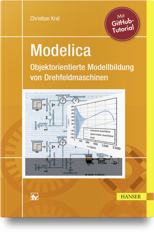

The book (published in German by [Hanser](https://www.hanser-fachbuch.de/buch/Modelica+Objektorientierte+Modellbildung+von+Drehfeldmaschinen/9783446455511)) is written for electrical engineers, since all examples are related with electrical power engineering and electrical machines. After a summary of the fundamental principles the first steps on creating and simulation Modelica models are provided. Each simulation example shown in the book is based on the open source library [HanserModelica](https://github.com/christiankral/HanserModelica). This library is fully tested with [OpenModelica](https://www.openmodelica.org/) so that the reader can perform all the simulation examples of the book solely on open source software.

Modelica is introduced based on both, the underlying theoretical concepts and practical applications. Engineering examples cover transient and quasi stationary electric circuits, and electrical systems coupled to the magnetic, thermal and mechanical models. The theory and the implementation of the polyphase electrical machine models released in the [Modelica Standard Library](https://github.com/modelica/ModelicaStandardLibrary) are explained and discussed in detail. Typical lab experiments of polyphase electrical machines are provided for induction and synchronous machines.

One chapter of the book presents a tutorial on [GitHub](https://github.com/) using [GitKraken](https://www.gitkraken.com/). In this chapter the author explains how a Modelica project can be initiated, developed and maintained through GitHub.
